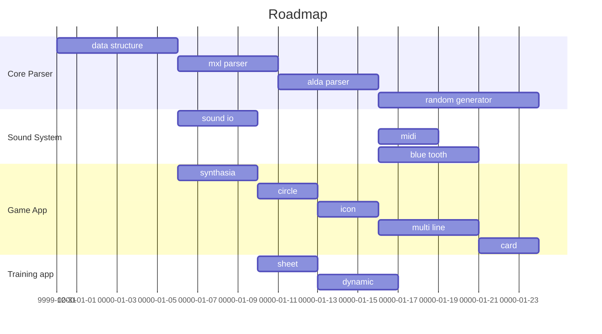

# POM Apps Proposal

POM games proposal

## app0 : [Versatile Utilities](Utility/)

## app1 : [Music Gamification](Gamification/)

## app2 : [Profissonal Training](Training)

## Roadmap

## Marketing/Promoting

* Basic Promoting
  * Able to use mxl, alda
  * Compatible to current community
  * Various visualization 
    * Staff
    * Tablature
    * Synthasia
    * Icon
    * Notation

* Advance Promoting
  * cooperate with youtuber channel
  * cooperate with music classroom, instrument store

* Musician are able to upload their songs score

## 營運
### 收費方式
* 類似體力制
  * 一天一種類型只能訓練20題 ex: 30級之後再綁
  * 想要擴增要買體力包
  * 新手優惠期 成癮之後再綁 (養套殺)
* 廣告
  * 體力耗盡的時候看廣告回體力
* 經驗加倍
  * 打題目獲得點數加倍，這樣可以加倍丟入角色成長
* 教育專案
  * 跟老師談一次性價格，學生ID會升級成VIP體力上限擴大
  * 音樂教室抽成
* 可以PK與否? 有聯機要素嗎
  * 排名會送不同獎勵
  * 包月好處是容易獲得排名

### 如何長青(過度擴張成本) 純遊戲化
* 角色卡抽卡
  * 每隔一段時間會新增可抽卡的角色人工畫
* 地圖增加
  * 每隔一段時間會新增可探索新地圖人工畫
* 系統擴充
  * 除了RPG打怪之外，未來會增加更多遊戲化系統
  * 經營模擬系統
    * 種花種草養寵物
    * 蓋房子
    * 雞生蛋
    * 隨著時間增加可養的寵物類型會更新增加
  * 服飾服裝系統
    * 美髮美甲美妝

## 市場大小問題
如果先做高難度產品，使用者太少而且又回到高門檻使用者少的問題

同時發展一部分高難度的題目(先做市面上沒有替代品的技術題目)

同時發展音game的市場拓展性

## 問卷設計>市場取向 

## 有雛型之後眾籌之前
開始談分潤、分股、技術分紅
參考崩壞三的team怎麼起來
崩壞一 > 二....> 米哈遊