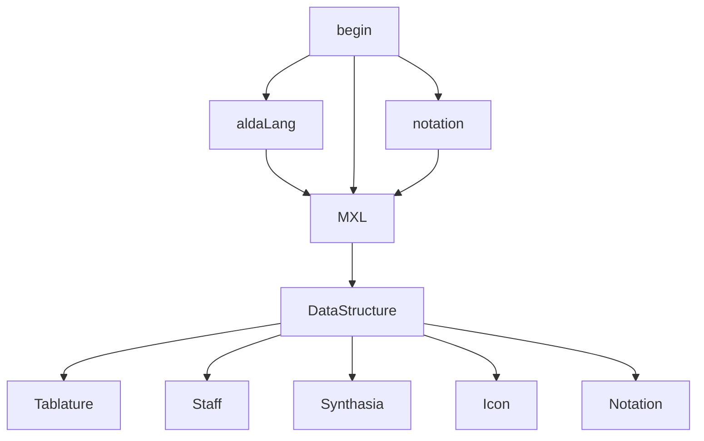

# POM Music Utility

## Purpose

##

## Content

* Platform
  * Mobile in major (1.3 billion at 2021)
  * PC in minor (340 million at 2021)
  * Tablet not target (67 million at 2021)

* Sale on 
  * steam
  * gog
  * google play store
  * apple store
  * etc.

## Data Structure

### 隱藏功能(好的古典/爵士風格樂譜,吃無版權的歌,xml)

### Other resources
[更多關於 **mermaid** 語法 <i class="fa fa-external-link"></i>](http://mermaid-js.github.io/mermaid)
&nbsp;
&nbsp;

roadmap tool

https://www.productplan.com/glossary/user-story/

# app 技術範圍

## 輸入方式：
手機版：
* 喇叭辨識
* 手勢(左半螢幕, 右半螢幕)
* (optional) 腳踏板

PC版：
* midi keyboard
* 手機/平板轉為midi keyboard
* 鍵盤
* 滑鼠
* 腳踏板

給一個時間校正
藍芽現在是low latency校正誤差很小

## Training Code Flow

Random generate alda with 127 measures

convert alda to musicxml format

parse musicxml to data structure

show measures on screen play sounds

reference:
https://github.com/musescore/MuseScore

script language:
alda-lang 
reference:
https://github.com/alda-lang/alda

## 需要關注的技術
AI寫程式?
AI辨識音樂

## 需要的技術

### 產品設計PM
去哪裡找

### 製作人
需要有人統合人力與時程、成本

### 理論作曲專業
需要有人懂音樂的分解分析  
初期的題目pattern可能必須由樂理專業的人去處理  
rule-base

### AI演算法
RNN + decision tree為主  
大型題目需要由AI生成合理的樂譜  
而即興部分需要由AI去評分多合該音樂風格  
近年AI研究所畢業人數眾多(但出來能用的沒幾個)，卻找不到工作，這部分應該不難找到人，問題在要如何篩選人  
(Data set mabye從社群get)  

### Unity3D程式設計師
本遊戲並非3A遊戲，使用unity3d較佳  
(外接midi使否可以當亮點)

### 遊戲化設計師
給予足夠動機，卻又融入原本的需求  
可以找桌遊設計師諮詢?

### 後端資料庫
伺服器 固定ip

### UX/UI
實現畫面設計
操作體驗
客製化處理 
設定
https://excalidraw.com/
https://www.figma.com/

### 國際化翻譯
需要將各種文件翻譯成英文，同時也要懂音樂專業名詞
或者先做英文，留語言介面擴充ex:中文 簡體/繁體

### 美術(後期)
初期外包，此遊戲是音樂為內涵，所以可以套上不同的世界觀  
後期如果有需要可以專門找人  

### 測試人員(後期)
完全不懂音樂的人能否真的從app中自發性進步並且學會樂理  
可外包  
甚至可能必須靠外包

