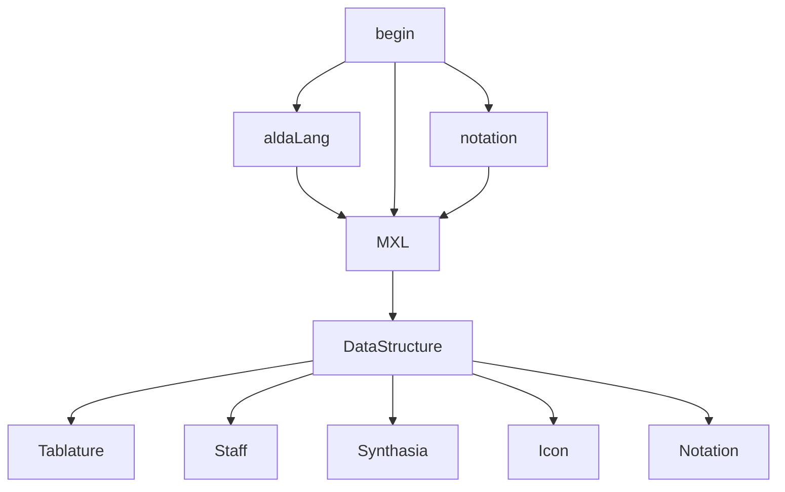

# POM Music Utility

## Purpose

##

## Content

* Platform
  * Mobile in major (1.3 billion at 2021)
  * PC in minor (340 million at 2021)
  * Tablet not target (67 million at 2021)

* Sale on 
  * steam
  * gog
  * google play store
  * apple store
  * etc.

## Data Structure

